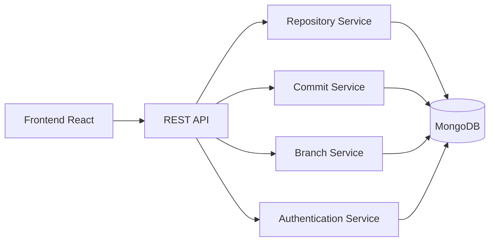

<div align="center">

# 🔄 Version Control System

### A Modern Git-Inspired Version Control Platform for Collaborative Development

<p align="center">
  
  
  
  
  
</p>

<p align="center">
  Track • Commit • Branch • Collaborate • Manage Versions
</p>

</div>

---

## 📖 Overview

Version Control System is a modern web-based platform inspired by Git workflows. It enables developers to manage repositories, track file changes, create commits, handle branches, and collaborate efficiently through an intuitive user interface.

The platform simplifies version management while providing a seamless developer experience for tracking project history and maintaining code integrity.

---

## ✨ Key Features

### 🔐 Authentication & Security
- User Registration & Login
- JWT Authentication
- Protected Routes
- Secure Session Management

### 📂 Repository Management
- Create Repositories
- Delete Repositories
- Repository Dashboard
- Repository Details View

### 📝 Commit Tracking
- Create Commits
- Commit History
- Version Timeline
- Change Monitoring

### 🌿 Branch Management
- Create Branches
- Switch Branches
- Merge Support
- Branch Visualization

### 👥 Collaboration
- Multi-user Support
- Repository Sharing
- Activity Tracking
- Contribution History

### 📊 Dashboard Analytics
- Repository Statistics
- Commit Overview
- User Activity Monitoring
- Version Insights

---

## 🖼️ UI Preview

### Dashboard

<p align="center">

</p>

### Repository Management

<p align="center">

</p>

### Commit History

<p align="center">

</p>

### Branch Management

<p align="center">

</p>

> Replace screenshots with actual project screenshots.

---

## 🏗️ System Architecture



---

## 🛠️ Tech Stack

### Frontend
- React.js
- Tailwind CSS
- React Router
- Axios
- Context API

### Backend
- Node.js
- Express.js
- JWT Authentication

### Database
- MongoDB

### Deployment
- Vercel
- Render

---

## 📂 Project Structure

```bash
src/
│
├── components/
├── pages/
├── layouts/
├── services/
├── context/
├── hooks/
├── routes/
├── assets/
└── utils/
```

---

## ⚙️ Installation

### Clone Repository

```bash
git clone https://github.com/Umangi-webdev/version-control-system---frontend.git
```

### Navigate to Project

```bash
cd version-control-system---frontend
```

### Install Dependencies

```bash
npm install
```

### Start Development Server

```bash
npm run dev
```

---

## 🔑 Environment Variables

Create a `.env` file in the root directory.

```env
VITE_API_URL=http://localhost:5000/api
```

---

## 🚀 Deployment

### Frontend Deployment

```bash
npm run build
```

Deploy the generated build folder to:

- Vercel
- Netlify
- Render

---

## 🎯 Future Enhancements

- Pull Request System
- Merge Conflict Resolution
- File Diff Viewer
- Real-Time Collaboration
- Notifications System
- Repository Permissions
- Dark Mode Support

---

## 📈 Learning Outcomes

This project demonstrates:

- MERN Stack Development
- Authentication & Authorization
- State Management
- REST API Integration
- Repository Management Concepts
- Version Control Workflows
- Responsive UI Design

---

## 🤝 Contributing

Contributions are welcome!

1. Fork the repository
2. Create a feature branch

```bash
git checkout -b feature-name
```

3. Commit changes

```bash
git commit -m "Added feature"
```

4. Push changes

```bash
git push origin feature-name
```

5. Open a Pull Request

---

## 👩‍💻 Author

### Umangi Patel

Full Stack Developer | MERN Stack Enthusiast

<p align="left">
<a href="https://github.com/Umangi-webdev">

</a>
<a href="https://linkedin.com">

</a>
</p>

---

<div align="center">

⭐ If you like this project, give it a star!

</div>
